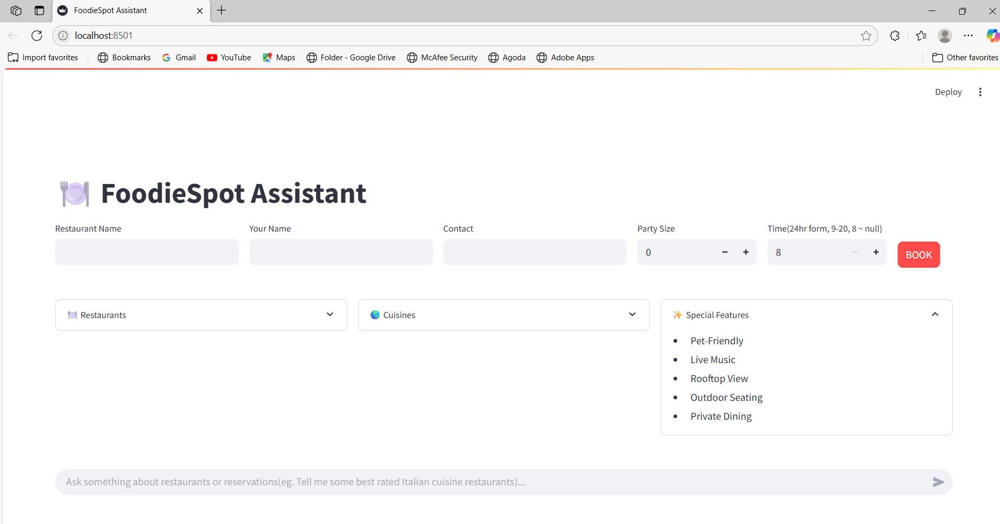
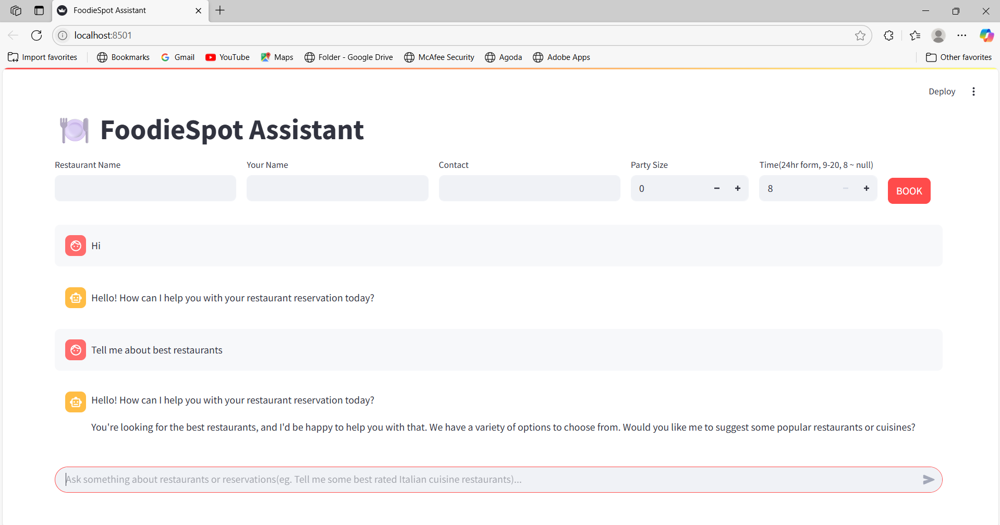
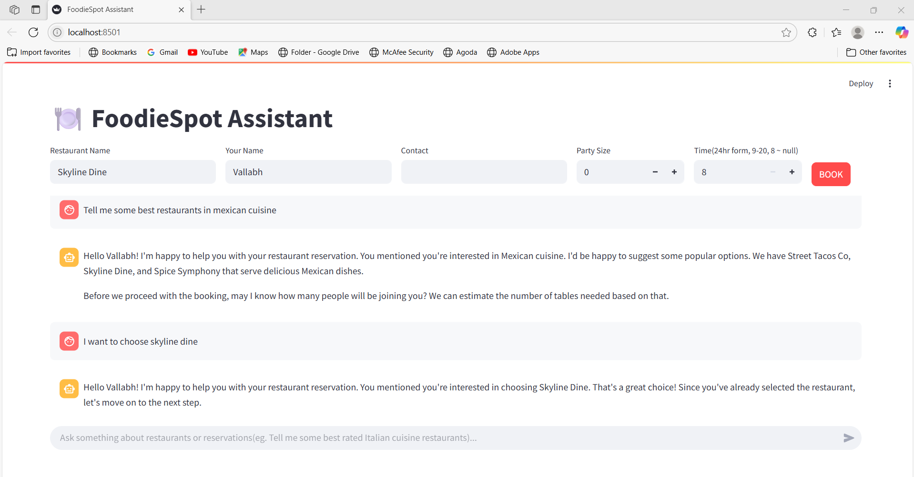
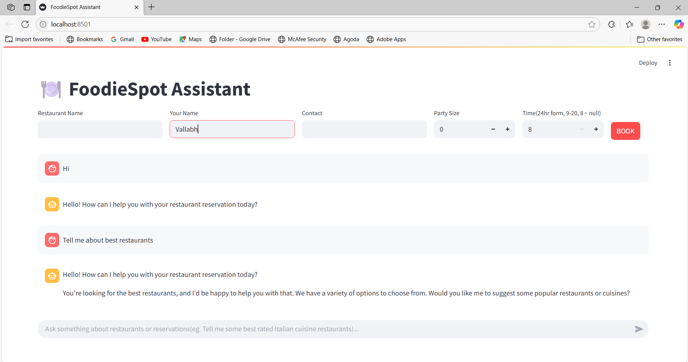
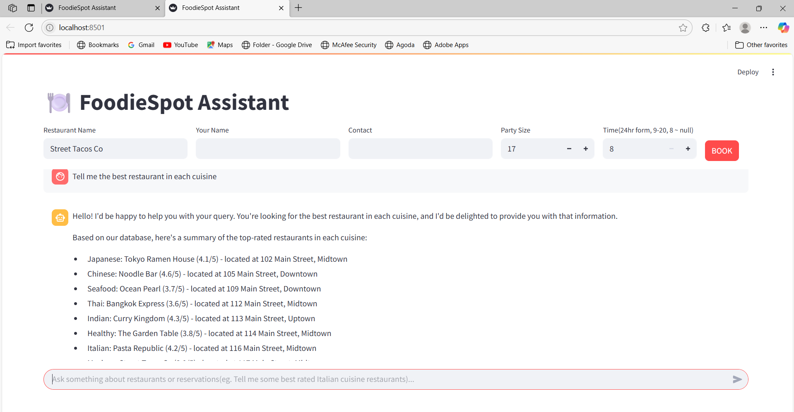
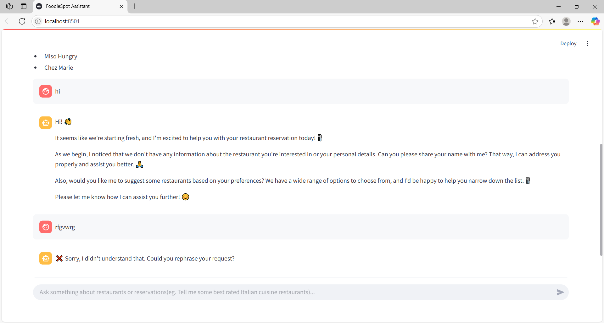
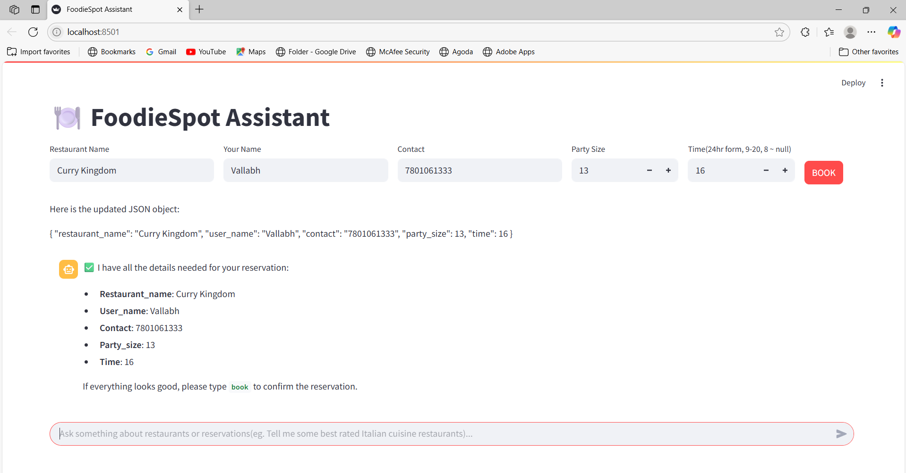
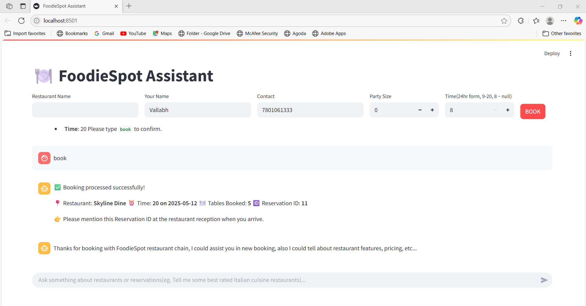

#  Restaurant Reservation Assistant – LLM + Streamlit App

## 🚀 Overview

This is a conversational restaurant reservation assistant built using **LLMs (llama3-8b-8192)**, **Streamlit**, and **SQLite**. The assistant interacts with users in natural language to help them book tables, answer restaurant queries, and manage reservation workflows.

---

## ⚙️ Setup Instructions

### 🛠️ Requirements

* `Python 3.8+`
* `chromadb==1.0.10`
* `openai==1.82.0`
* `pandas==2.2.3`
* `redis==6.1.0`
* `sentence-transformers==4.1.0`
* `streamlit==1.45.1`
* `transformers==4.52.3`


### 🧩 Installation

```bash
git clone https://github.com/Sri-Vallabh/LLM-based-restaurant-reservation-chatbot.git
cd restaurant-reservation-assistant
pip install -r requirements.txt
```

### 🔗 Running the App

```bash
streamlit run app.py
```

Ensure the `restaurant_reservation.db` is in the /db folder inside  the root directory. This contains all restaurant, table, slot, and reservation data.


---

## 🧠 Language Model & Retrieval Architecture

This project leverages **Meta’s LLaMA 3 8B** language model (`llama3-8b-8192`), accessed via **Groq’s OpenAI-compatible API**. Groq’s unique **LPU (Language Processing Unit)** hardware delivers ultra-fast inference speeds—up to 876 tokens per second for LLaMA 3 8B—enabling near-instantaneous responses even for complex, multi-step conversations. The model’s 8192-token context window allows it to efficiently process extended dialogues, rich database results, and prompt histories.

The system is built around a **Retrieval-Augmented Generation (RAG)** architecture. Here’s how it works:

- **Semantic Search & Retrieval:**  
  - **ChromaDB** is used as the vector database to store embeddings of restaurant, table, and slot data.
  - User queries and database content are converted to embeddings using the **all-MiniLM-L6-v2** sentence transformer model from Hugging Face’s Sentence Transformers library.
  - This enables the system to quickly find semantically similar information, such as restaurants matching a cuisine or tables with specific features.
- **Grounding in Real-Time Data:**  
  - The LLM is provided with both the results of semantic search and, when needed, structured data retrieved from the SQLite database.
  - This ensures responses are always up-to-date and contextually accurate.
- **Modular, Multi-Step Processing:**  
  - The LLM is used in a modular fashion, with specialized prompts for each stage of the conversation:

### **Key Processing Steps**

1. **Intent Detection**  
   Determines the user’s goal—booking a table, checking availability, asking general questions, or handling edge cases and non-sequiturs.

2. **Information Extraction**  
   Extracts structured fields (restaurant name, user name, contact info, party size, reservation time) from free-form user input.

3. **Extracting information from database**  
   - **Semantic Search:** For natural language queries (e.g., “Italian restaurants with outdoor seating”), the LLM triggers a semantic search in ChromaDB, powered by `all-MiniLM-L6-v2` embeddings.
   ### Cases where semantic search approach fails:
   - **SQL Query Generation:** For precise data requests (e.g., “Show all tables available at 7pm”), the LLM generates SQL queries to fetch data from the SQLite database.

4. **Result Interpretation**  
   Converts raw SQL or semantic search results into clear, conversational summaries for the user.

5. **Multi-Turn Dialogue Management**  
   Maintains context across messages, using previous inputs and system memory to build coherent, helpful conversations with the user.

### **Security & Control**

- **No Direct Booking by LLM:**  
  For security, the LLM is not permitted to perform direct database modifications. Final reservations are handled by a dedicated, safeguarded logic module.
- **Prompt Engineering:**  
  Each task (intent, extraction, query, summarization) is managed by a specialized prompt, improving reliability and modularity.

---

## **In summary:**  
This architecture combines the speed and intelligence of LLaMA 3 via Groq with robust retrieval from ChromaDB (using `all-MiniLM-L6-v2` embeddings) and SQLite, ensuring fast, accurate, and context-aware responses for every user query.


## 💬 Example User Journeys with Application Walkthrough


Below are screenshots showing the end-to-end flow of the restaurant reservation assistant in action:

---

### 🟢 Image 1: Landing Page  


The landing page welcomes users and prompts:  
**"Ask something about restaurants or reservations..."** 


This initiates a free-form, conversational interface for users to interact naturally.
Here, also names of restaurants, cuisines, special features can be seen, which also stays along with the conversation thread which is scrollable.

---

### 💬 Image 2: General Conversation  


The assistant engages in friendly conversation, understanding user intent like greetings, small talk, or queries about restaurants.

---

### 🔍 Image 3: Database Query + Interpretation  


The assistant first uses ChromaDB with semantic search to quickly retrieve relevant answers from a knowledge base. If no confident result is found, it dynamically generates an appropriate SQL SELECT query, executes it on the structured database, interprets the result, and returns a natural, conversational response.

---

### 🤝 Image 4 to 6: Information Gathering + Suggestions  
  
 
### Handling random text
 

Through ongoing conversation, the assistant extracts necessary reservation information:  
- 🏨 Restaurant name  
- 🙋 User name  
- 📱 Contact  
- 👥 Party size  
- ⏰ Time

It continues to help the user by checking availability and making suggestions.

---

### ✅ Image 7: Ready for Booking Confirmation  


Once all required information is gathered, the assistant summarizes the reservation details and asks for user confirmation with a simple **`book`** command.

---

### 🧾 Image 8: Booking Confirmation  


Booking is processed successfully!

- Restaurant: **Pasta Republic**  
- Time: **20 on 2025-05-12**  
- Party size: **15**  
- Tables booked: **4** (4 tables are needed to accomodate 15 people as one table has 4 seating capacity)  
- Reservation ID: **#10** 
The system calculates the number of tables needed using `ceil(party_size / 4)`, verifies table availability, reserves the required slots, and finalizes the booking.

The assistant informs the user:


👉 Please mention this Reservation ID at the restaurant reception when you arrive.

This flow demonstrates a complete, intelligent reservation assistant that uses natural language processing, database querying, and interactive UX logic to help users make hassle-free bookings.


---
## Some other results:


---
### If user enters random text:


# Database explanation
* **`restaurant_reservation.db`**:

  * This SQLite database contains the following tables:

    * **`restaurants`**:

      * Stores information about each restaurant, such as its **name**, **cuisine**, **location**, **seating capacity**, **rating**, **address**, **contact details**, **price range**, and **special features**.
      * The **`id`** field serves as a unique identifier for each restaurant.
      * **Important Note**: The **`id`** is used internally in the database and should not be exposed to the user.

    * **`tables`**:

      * Stores information about tables at each restaurant.
      * Each table is associated with a **`restaurant_id`**, linking it to a specific restaurant.
      * Each table has a **capacity** (default is 4), which indicates how many guests it can accommodate.
      * The **`id`** field uniquely identifies each table and should not be shared with the user.

    * **`slots`**:

      * Stores information about the availability of each table.
      * Each slot corresponds to a **1-hour** time block for a specific table on a particular day (e.g., a table might have slots available from **9AM to 9PM**).
      * **`is_reserved`** indicates whether the slot is booked (**1**) or available (**0**).
      * **`date`** is hardcoded to **2025-05-12**, and the **`hour`** field defines the start time for the reservation (ranging from **9** to **20**, representing 9AM to 8PM).
      * The **`slot.id`** and **`table_id`** are used to uniquely identify the slots and link them to the relevant tables.

    * **`reservations`**:

      * Stores reservation details made by the user, including:

        * **`restaurant_id`**: Links the reservation to a specific restaurant.
        * **`user_name`**: The name of the user who made the reservation.
        * **`contact`**: The contact details (e.g., phone number) of the user.
        * **`date`**: Hardcoded to **2025-05-12**, representing the reservation date.
        * **`time`**: The starting hour of the reservation, which matches a slot's **hour** field.
        * **`party_size`**: The number of people for whom the reservation is made.
      * The **`id`** is used to uniquely identify each reservation, but it is not exposed to the user.

    * **`reservation_tables`**:

      * A junction table that links reservations to tables.
      * Contains:

        * **`reservation_id`**: Links the reservation to the **`reservations`** table.
        * **`table_id`**: Links the reservation to the relevant **`tables`**.
      * This table helps associate a reservation with the actual tables that are booked for that reservation.


## 📄 Prompt Engineering Strategy

### ✨ Design Principles

1. **🔁 Separation of Concerns**
   For different purposes, I have engineered different prompts that are modular, making the assistant easier to debug, maintain, and enhance:

   * **Intent classification** (`determine_intent.txt`)
   * **Information extraction** (`store_user_info.txt`)
   * **SQL query generation** (`schema_prompt.txt`)
   * **SQL result interpretation** (`interpret_sql_result.txt`)
   * **Natural reply generation** (`generate_reservation_conversation.txt`)

2. **🧠 Context-Aware Memory Management**

   * Maintains `chat_history`, `user_data`, and `last_reply` using Streamlit session state.
   * Tracks conversation context across turns to avoid repetition, keep interactions natural, and gracefully handle incomplete data.

3. **✅ Controlled Confirmation Flow**

   * Prompts ensure that **only when all required fields (restaurant name, name, contact, party size, and time)** are filled, the assistant proceeds to ask for booking confirmation.
   * Prevents accidental bookings and ensures user consent before writing to the database.

4. **🛡️ Safe Query Execution**

   * Only **SELECT statements** generated by the LLM are allowed to be executed directly.
   * INSERT/UPDATE operations (like booking a reservation) are handled by a **separate, controlled module**, protecting the database from unintended writes or corruption.

5. **📦 Iterative Prompt Optimization**

   * Prompts have been fine-tuned through iterative experimentation and real conversation testing.
   * Incorporated **few-shot examples** where relevant to guide the LLM.
   * Prompts are designed to gracefully handle edge cases, e.g., when users give partial or ambiguous information.

6. **📏 Robust Format Enforcement & Cleaning**

   * JSON outputs (e.g., for `store_user_info`) include explicit instructions on quoting keys/values to prevent parsing issues.
   * Pre/post-processing logic strips any unexpected or extra text surrounding JSON responses from the LLM.
   * Regular expressions and cleaning checks are used to sanitize LLM responses before using them in downstream logic.

7. **🌐 User-Centric Design**

   * Prompts use natural, polite tone and context-aware replies, improving user trust and UX.
   * Conversational flow shifts fluidly between transactional (booking) and informational (restaurant FAQs) based on detected intent, also handling **multiple-intent** cases.

---


### ⚠️ Error Handling & Edge Cases

This assistant is designed to offer a smooth and reliable user experience, even in unexpected scenarios. The following mechanisms are implemented to handle errors and edge cases effectively:

#### ✅ Error Handling

* **LLM Output Sanitization**:
  When the LLM occasionally adds extra text before or after the expected response (e.g., in SQL queries), the output is parsed and cleaned using regex or string manipulation to extract only the required format. This ensures that unexpected formatting does not break the application.

* **Safe Execution with Try-Catch Blocks**:
  All critical operations — especially SQL queries and bookings — are wrapped in `try-except` blocks. This prevents the UI from crashing and allows the assistant to gracefully inform the user about what went wrong.

* **Pre-Booking Availability Recheck**:
  Just before finalizing a reservation, the system re-checks for table and slot availability. This is to prevent race conditions where multiple users might try to book the same slot at the same time — ensuring consistency and avoiding double bookings.

 * **Preventive measures for malicious data injection/Database modification by prompt**:
The LLM does not directly execute SQL INSERT statements. Instead, it only interprets user intent, and can perform certain select queries to gather information. There is a dedicated backend module securely handles data injection for reservations , reducing the risk of malicious injection or malformed queries.

---

#### 🔍 Edge Cases

* **Random or Nonsensical User Input**:
  If a user inputs irrelevant or nonsensical text (e.g., "asdf123", emojis, or spam), the assistant classifies it as an invalid intent (tagged as `RUBBISH`) and politely asks the user to rephrase or clarify their request.

* **Partial Reservation Information**:
  When users provide only some details (e.g., name but not time), the assistant remembers the known information and continues the conversation by asking only for the missing fields, without repeating previously collected data.

* **Privacy Protection**:
Users cannot ask about bookings made by others. The SQL data access layer enforces this by exposing only the current user’s booking context. There is no direct query access to personal or third-party reservation data.

* **Restaurant Not Found**:
  If the user provides a restaurant name that does not exist in the database, the assistant notifies them and may offer to show a list of available restaurants.

* **Unavailable Timeslots**:
  If the requested time has no available tables (due to existing reservations), the assistant explains this clearly and suggests choosing a different time.

---

By handling these cases gracefully, the assistant ensures that users have a seamless experience even when unexpected situations arise.


## 🧭 Assumptions, Limitations & Enhancements

### Assumptions:
* There is a hardcoded 4-person table capacity, so the system itself selects multiple tables that are available at that time.
* Reservation slots are fixed to **2025-05-12**, and all reservations are for this date.
---
### ⚠️ Limitations:

* The system currently supports reservations only for a fixed date (2025-05-12). This could be extended to multi-day support by adding appropriate entries to the database.
* Since the system relies on Large Language Models (LLMs), there's **no absolute guarantee of perfect behavior**—LLMs can occasionally misinterpret queries, miss context, or produce inaccurate outputs.
* **Table preferences cannot be specified** by the user. The system auto-assigns tables based on availability, so users cannot choose specific table locations (e.g., window-side, outdoor, etc.).
* Only **select queries** are executed directly by the LLM to ensure **data safety**. For insert/update operations (e.g., booking), a separate transaction module is used.


---
### Future Enhancements:

* Expand the system to allow for multi-day reservations.
* Also add table preferences to choose(eg. beside window,private space).
* Add features like user authentication, personalized recommendations, and more sophisticated handling of party sizes and table combinations.

### 🔮 Future Enhancements in deployment

* ✅ Date picker and calendar integration
* 📲 SMS/WhatsApp confirmation with reservation ID
* 🧾 Admin dashboard to manage reservations & analytics
* 🌐 Multilingual support for non-English customers
* 🔌 API-first backend to support mobile and kiosk interfaces

---


## 📎 File Structure

```
├── app.py
├── tools.py
├── var.py
├── requirements.txt
├── prompts/
│   ├── determine_intent.txt
│   ├── generate_reservation_conversation.txt
│   ├── interpret_sql_result.txt
│   ├── schema_prompt.txt
│   └── store_user_info.txt
├── db/
│   └── restaurant_reservation.db
└── README.md
```

### Explanation of Each File

#### 1. **`app.py`**

* The main application file that drives the restaurant reservation system.
* Handles user input, coordinates prompt usage, calls functional tools, executes SQL queries, and returns conversational responses.
* Acts as the central orchestrator between all components.

#### 2. **`tools.py`**

* Contains core utility functions used throughout the system.
* Includes logic for:

  * Determining user intent
  * Storing and updating user information
  * Generating reservation-related conversations
  * Creating and interpreting SQL queries
* Serves as the modular backend logic layer for reusable operations.

#### 3. **`var.py`**

* Defines classes and configuration variables.
* Includes:

  * `SchemaVectorDB`: for handling schema-related semantic search
  * `FullVectorDB`: for broader retrieval tasks using vector similarity
* Facilitates integration of ChromaDB and semantic retrieval workflows.

#### 4. **`prompts/` Folder**

Stores prompt templates that guide the behavior of the language model (LLM):

* **`determine_intent.txt`**:
  Prompt for classifying user messages into intents like `greet`, `select`, `book`, or irrelevant.

* **`generate_reservation_conversation.txt`**:
  Handles multi-turn interactions to collect user details and guide reservations.

* **`interpret_sql_result.txt`**:
  Formats raw SQL query results into natural-sounding responses.

* **`schema_prompt.txt`**:
  Describes the SQLite database schema and provides rules for query generation.

* **`store_user_info.txt`**:
  Extracts and stores user details like name, contact info, party size, and reservation time.

#### 5. **`db/` Folder**

* Contains the SQLite database (`restaurant_reservation.db`) with all restaurant, table, and reservation information.
* Used to run SQL queries for booking and retrieving restaurant details.

---


## 📊 Vertical Expansion

This solution can be adapted for:

* ✈️ Airlines (seat booking assistants)
* 🏥 Clinics & Hospitals (appointment schedulers)
* 🎟️ Event Ticketing Systems (concerts, sports, etc.)
* 🏨 Hotels (room booking, amenities)

---

## 🥇 Competitive Advantages

1. 🔁 Multi-turn conversation memory (session-state-based and intent based)
2. 🧠 Contextual intent handling with seamless switching between FAQ and transactional flows
3. 📦 Modular LLM prompt architecture for future scaling
4. 🔒 Secure and Controlled SQL Access
Only read-only SQL (SELECT) statements are generated and executed via the LLM to prevent any risk of data corruption.
Reservation actions like INSERT or UPDATE are handled securely in a separate logic module, ensuring strict control over data modification.

---

## 📅 Implementation Timeline

| Phase   | Description                            | Duration |
| ------- | -------------------------------------- | -------- |
| Phase 1 | Database creation+LLM sql query creation and interpretation              | 1st day   |
| Phase 2 | Intent detection+conversational flow | 1st day  |
| Phase 3 | Booking and edge-case handling    | 2nd day    |
| Phase 4 | Presentation & packaging               | 2nd day    |

---

## 👥 Key Stakeholders

* Restaurant Manager / Owner
* Frontdesk / Host
* Customer Service Ops
* Technical Dev Team

---


